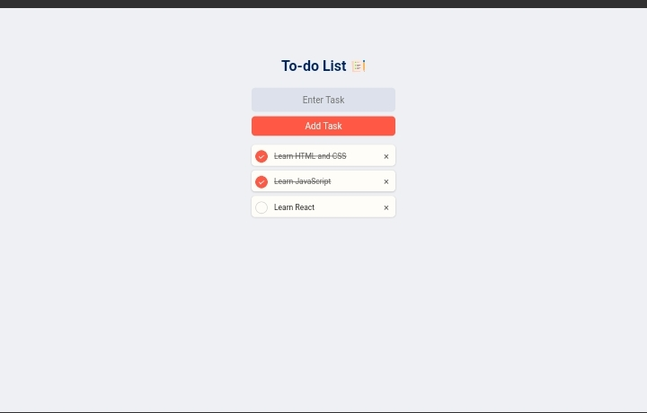

# To-Do List App

A simple, responsive, and user-friendly To-Do List application that allows users to add, manage, and remove tasks. The app saves tasks to `localStorage` so they persist even after refreshing the page.

## Features

- Add tasks to the list.
- Mark tasks as completed by clicking on them.
- Remove tasks using the delete (×) icon.
- Tasks persist using `localStorage`.

## Screenshot





## Built With

- **HTML5** - Structure and content of the app.
- **CSS3** - Styling and layout, using Flexbox for responsiveness.
- **JavaScript** - Dynamic behavior, task management, and `localStorage`.

## Installation

To get a local copy up and running, follow these simple steps:

1. Clone the repository:

   ```bash
   git clone https://github.com/yourusername/todo-list-app.git